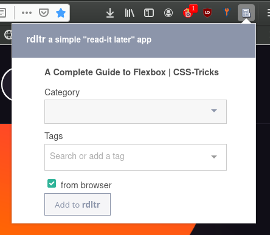

# rdltr-addon

> ⚠️ **rdltr-addon** is no longer maintained.

Firefox add-on to add articles to an [rdltr](https://github.com/SamR1/rdltr) instance.

## Preferences

Just enter instance url and credentials to connect to **rdltr**.

## Popup

**Category** and **tags** are fetched with user profile when connecting to the **rdltr** instance. They are not mandatory when adding article.  
**from browser** allows to send active tab HTML content to **rdltr** (needs rdltr 0.1.6+).

---

Notes:

- web extension generated with [Kocal/vue-web-extension](https://github.com/Kocal/vue-web-extension) (v1)
